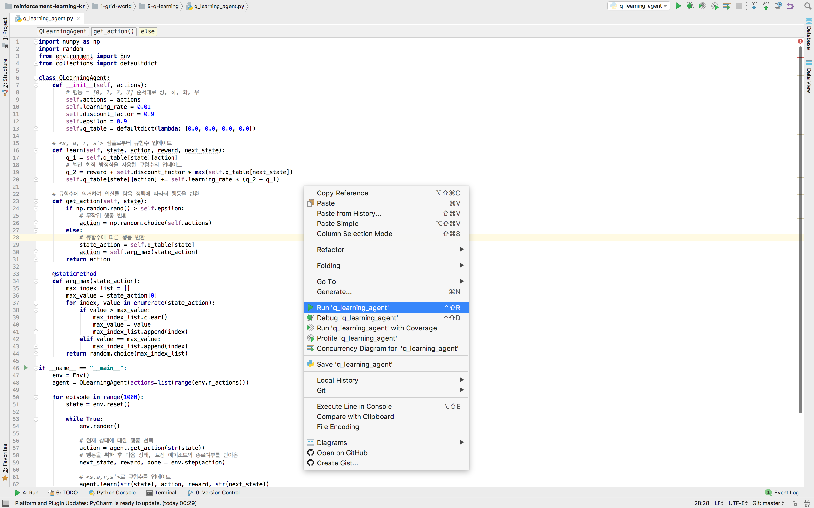
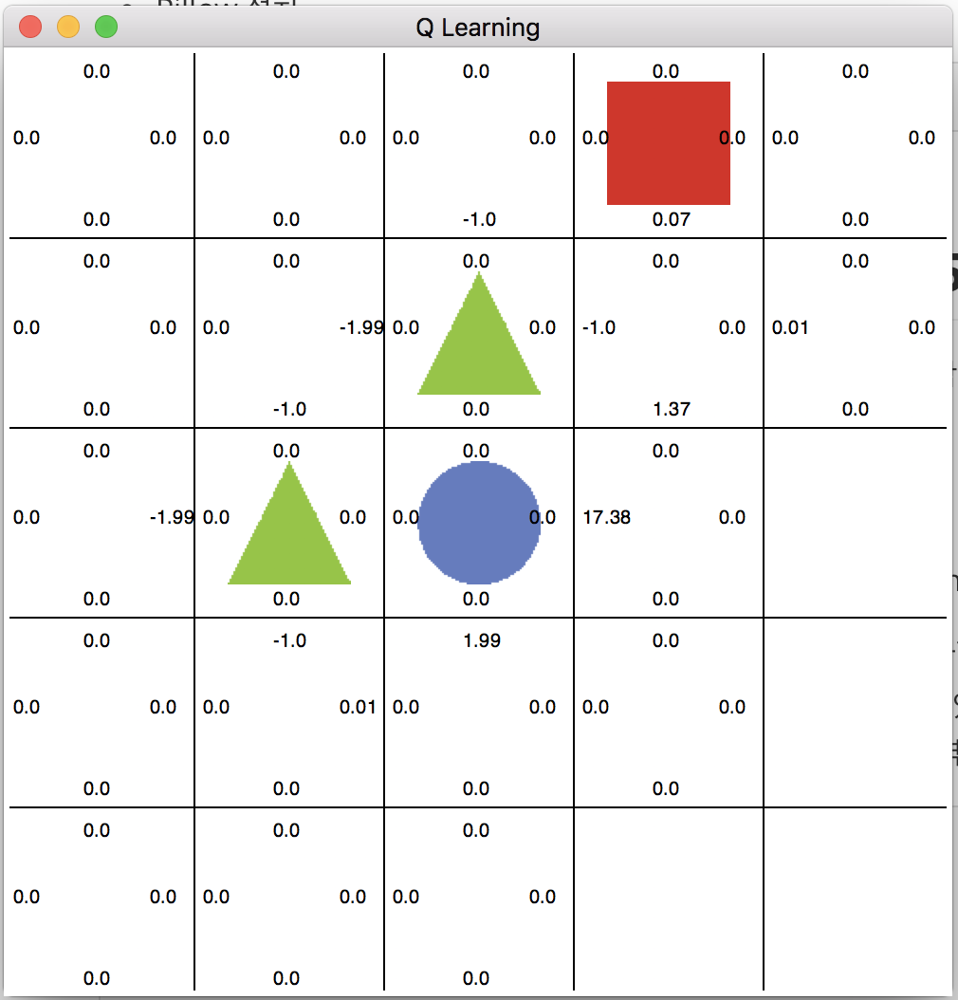
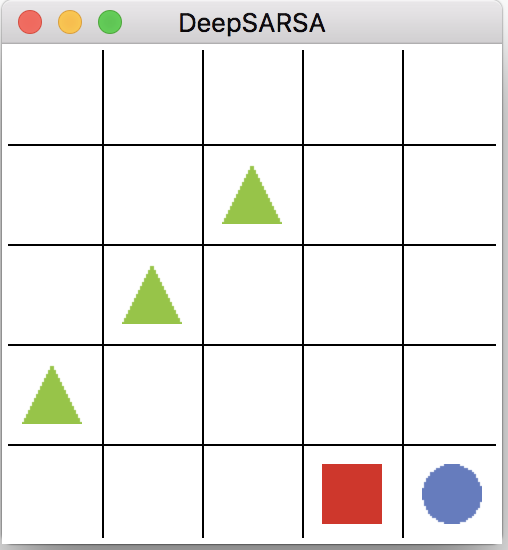

## 개발 환경 설정 : 리눅스 (우분투)

리눅스는 소스코드가 공개된 대표적인 오픈소스 운영체제입니다. 리눅스는 모든 소스가 공개되어 있으므로 정말 많은 종류가 있습니다. 그중에서도 우분투(Ubuntu)가 가장 넓은 사용자를 가진 배포판입니다. 매년 상반기 하반기 우분투 재단에서 새로운 버전을 배포하는데 이 책에서는 14년 상반기에 배포한 우분투 14.04 버전을 사용할 것입니다. 우분투 14.04가 설치되어 있다는 가정에 따라 이후의 개발환경 설정을 설명할 것입니다.


### 1. 우분투 파이썬의 버전 확인

리눅스의 장점은 바로 파이썬(Python)이 설치가 기본적으로 되어 있다는 것입니다. 파이썬은 2.X 버전과 3.X버전이 있는데 이 책에서는 `파이썬 3.5버전`을 사용할 것입니다. 바탕화면에서 `Ctrl+Alt+t`를 누르면 터미널 창이 뜨는데
여기에 다음 명령어를 치고 엔터를 누르면 설치된 파이썬의 버전을 확인할 수 있습니다.

```shell
   $ python -V
```

우분투 14.04 버전에는 `파이썬 2.7버전`과 `3.5버전`이 기본적으로 설치되어 있습니다.


### 2. 파이참 커뮤니티 설치 및 환경 설정

앞으로 강화학습 에이전트를 만들고 가상 환경에서 에이전트를 학습시킬 것입니다. 그러기 위해 코드를 짜고 편집하는
환경이 필요한데 그러한 환경을 IDE(interface Development Environment)라고 합니다. IDE에는 많은 종류가 있지만 이 책에서는 파이참(Pycharm)을 파이썬을 위한 IDE로 사용할 것입니다. 

파이참의 설치는 파이참의 공식 홈페이지[[1\]](#_ftn1)를통해서 할 수 있습니다. 홈페이지에서 윈도우, 리눅스, 맥 OS 버전의 파이참을 다운로드 할 수 있습니다. 파이참은 유료 버전인 `프로페셔녈(PyCharm ProfessionalEdition)`과, 무료 버전인 `커뮤니티(PyCharm Community Edition)`으로 나뉩니다. 앞으로 에이전트를 개발할 때 `파이참 커뮤니티`를 사용할 것이므로 커뮤니티 버전을 기준으로 설치법을 설명할 것입니다.


**설치는 다음과 같은 순서로 진행합니다.**

1. 파이참 공식 홈페이지[[Link]](https://www.jetbrains.com/pycharm/download/#section=linux) 링크에서 파이참 커뮤니티버전을 다운로드합니다.


<p align="center"></p>

   ​

2. 다운받은 경로로 들어가서 다음 명령어로 압축파일을 풀어줍니다.

   ```shell
   $ tar xfz pycharm-community-2016.3.2.tar.gz
   ```


3. 압축을 푼 후 아래 경로(bin폴더)로 이동합니다.

   ```shell
   $ cd ~/pycharm-community-2016.3.2/bin
   ```
   ​

4. 다음 명령어로 파이참을 실행합니다.

   ```shell
   $ sh pycharm.sh
   ```
   ​

   <p align="center"></p>

   ​


5. 명령어가 실행되면 설치가 시작됩니다.

   ​

6. 설치가 완료되면 다음 화면과 같은 초기 환경설정 화면을 볼 수 있습니다. 

   ​

   <p align="center"></p>

   ​

   IDE theme 항목에서 Intellij는 바탕이 흰색인 테마이고 Darcula 테마는 바탕이 검은색입니다. 이
   책에서는 Intellij를 테마로 사용합니다.

   ​

7. 초기설정이 완료된 후의 화면입니다. 여기서 프로젝트 생성을 해봅니다.

   <p align="center"></p>

   ​

   ​

8. 프로젝트의 경로와 Interpreter를 설정하는 화면입니다. Home 디렉터리에 PycharmProjects 폴더를 생성하고 그 하위에 프로젝트를 생성합니다. 프로젝트의 이름은 독자가 임의로 정하도록 합니다. “rlcode_book” 이름으로 프로젝트를 생성하는데 Interpreter를 설정해줍니다. Interpreter는 이 프로젝트에서 사용할 언어인데 python 3.5라고 설정합니다.

   ​

   <p align="center"></p>
   ​

9. rlcode_book 프로젝트가 생성되면 아래와 같은 화면이 나옵니다.

   ​

   <p align="center"></p>

   ​

   ​

10. 파이참이 정상적으로 설치되었는지 확인하기 위해 파이썬 스크립트 파일을 생성해봅니다. 가장 간단한 예제인 `“Hello World”`를 실행하기 위해 다음과 같이 hello_world.py 파일을 생성합니다.
  ​

 <p align="center"></p>
 ​

11. 생성한 파일에 마우스 커서를 놓고 오른쪽 버튼을 누르면 여러 항목이 나옵니다. 그 중에서 “Run ‘hello_world’” 버튼을 누르면 hello_world.py 파일을 실행할 수 있습니다. 
    ​

   <p align="center"></p>


12. hello_world.py 파일 안에 다음 코드를 입력합니다.
   ```python
   print("hello world")
   ```


13. hello_world.py 파일을 실행시키면 아래 화면과 같이 실행 창에 “hello world”가 나옵니다. 이를 통해 파이참이 정상적으로 설치된 것을 확인할 수 있습니다.

   ​

   <p align="center"></p>


## Git 설치

혹시, 우분투에 Git설치가 안되신 분은 강의자료 다운로드를 위해 Git 설치를 권장합니다.

```shell
$ sudo apt-get install git
```


## 튜토리얼 예제 코드 및 발표자료 다운로드

Github 레포지토리에 튜토리얼 코드 및 발표자료가 업로드 되어있습니다.

Git을 이용해서 다운로드 할 수 있습니다.

다운로드를 원하는 디렉토리로 이동 후 다음 명령어를 이용해 다운로드 할 수 있습니다.

```shell
$ git clone https://github.com/rlcode/rlcode-tutorial.git
```


## Numpy, Pillow 설치

그리드 월드 예제를 실행하기 위해 다음 패키지를 설치해야 합니다.

터미널에서 다음 명령어를 실행하여 설치합니다.

- **Pillow** : 파이썬 이미지 라이브러리 입니다.


명령어 프롬프트(cmd)창에서 다음 명령어를 실행하여 설치합니다.

```shell
$ pip install Pillow
```
<p align="center">


- **Numpy** : 파이썬 

  Numpy도 pillow와 같이 명령어 프롬프트창(cmd)에서 다음 명령어로 설치합니다.

  ```shell
  $ pip install numpy
  ```

  <p align="center">


## 큐러닝(Q-Learning) 실행

그리드월드 예제로 큐러닝을 실행합니다.

파이참에서 오른쪽 클릭 후 Run을 클릭해서 실행합니다.

<p align="center"></p>

혹은, 터미널에서 해당 디렉토리에서 명령어를 통해 실행할 수 있습니다.

```shell
$ python q_learning_agent.py
```

큐러닝 실행화면 입니다.

<p align="center"></p>


## Tensorflow, Keras, Matplotlib, h5py 설치

딥살사(deep-SARSA)를 실행하기 위해 다음 라이브러리들을 설치해야합니다.

Numpy, Pillow와 설치 방법은 같습니다.

명령어 프롬프트창(cmd)에서 다음 명령어를 실행하여 설치합니다.

- **tensorflow** : 딥러닝 오픈소스 프레임워크

  ```shell
  $ pip install tensorflow
  ```

  <p align="center"></p

  ​


- **Keras** : tensorflow wrapper모듈(이 튜토리얼에서 Keras는 tensorflow를 backend로 사용합니다.)

  ```shell
  $ pip install keras
  ```

  <p align="center"></p>

- **Matplotlib** : 파이썬 2-D plotting 라이브러리(에이전트의 리워드를 그래프로 시각화하기 위한 용도)

  ```shell
  $ pip install matplotlib
  ```

  <p align="center"></p>

  ​

- **h5py** : HDF5 바이너리 데이터 포맷의 형식을 저장하고 불러 올 수 있게하는 파이썬 라이브러리 입니다
  ​            (튜토리얼에서 학습된 에이전트 모델을 저장하고 불러오는 역할을 합니다.) 

  ```shell
  $ pip install h5py
  ```


## 딥살사(Deep-SARSA) 실행

위의 환경설치를 완료하고 딥살사를 실행합니다. 이번 튜토리얼을 정상적으로 진행하기 위해 딥살사가 실행되어야 합니다.

파이참에서 오른쪽 클릭 후 Run을 클릭해서 실행합니다.

<p align="center"></p>

또는, 터미널에서 해당 디렉토리에서 명령어를 통해 실행할 수 있습니다.

```shell
$ python deep_sarsa_agent.py
```

딥살사 실행화면 입니다.

<p align="center"></p>